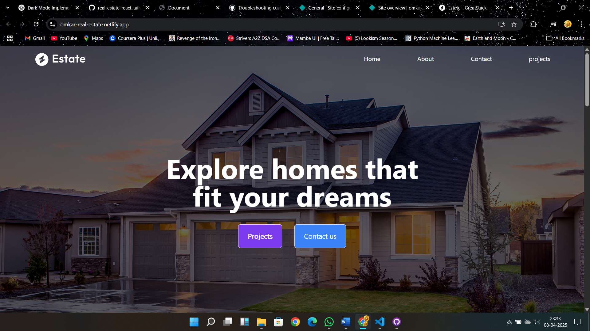

# 🏠 Omkar Real Estate Website

Welcome to **Omkar Real Estate**, a sleek and responsive website built to showcase real estate **projects**, provide **contact information**, and share **reviews from satisfied clients**.



🔗 [Live Demo](https://omkar-real-estate.netlify.app/)

---

## ✨ Features

- 🏢 Showcases current real estate **projects**
- ✍️ Allows users to read **reviews** from other people
- 📞 **Contact section** for direct communication
- 🔍 Smooth navigation bar for quick access
- 📱 **Fully responsive** design for all screen sizes
- 🌟 Clean and modern layout using vanilla HTML, CSS & JS

---

## 🧰 Tech Stack

- **HTML5**
- **CSS3** (Flexbox, Grid, Media Queries)
- **JavaScript**
- **Netlify** for deployment

---

## 🚀 Getting Started

1. Clone the repository:
   ```bash
   git clone https://github.com/your-username/omkar-real-estate.git
   cd omkar-real-estate
